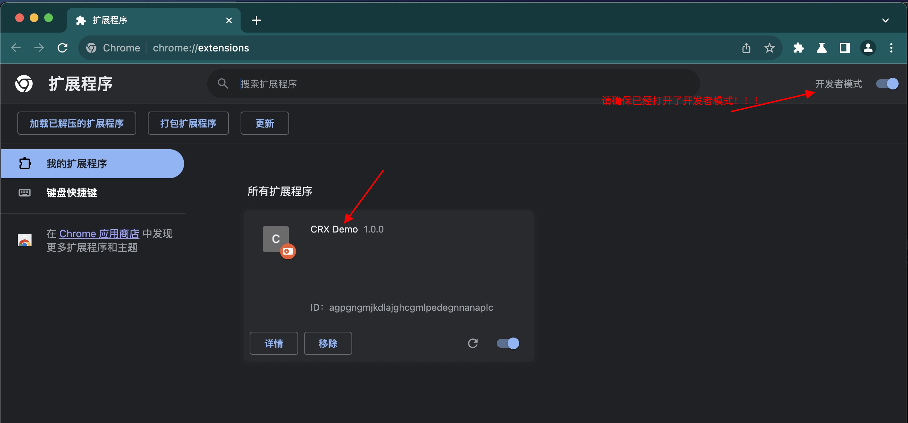
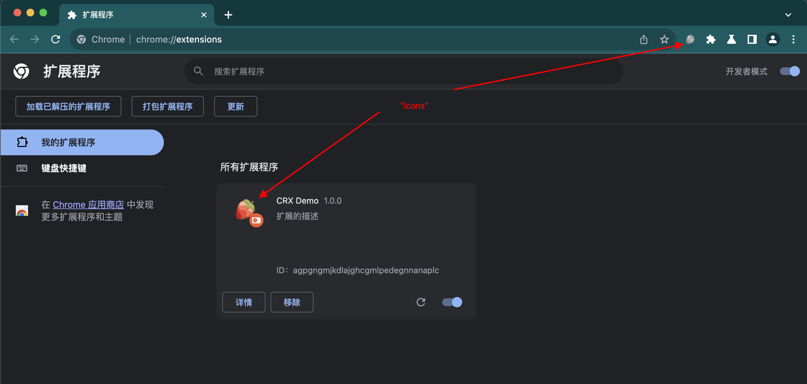

大家好，我是dom哥。我正在写关于 Chrome 扩展开发的系列文章，感兴趣的可以[点个小星星](https://github.com/dom-bro/chrome-extension-development)。

Chrome 在全球浏览器市场份额独占 6 成，无论是对普通用户还是开发者，都是电脑里的必备利器。Chrome 无论是在性能还是 UI 交互方面都非常出色，而 Chrome 扩展则为开发者提供了接口，让开发者有能力自己编写代码使自己的 Chrome 更强大，更加定制化。

**每个 Chrome 扩展项目的根目录中都必须有一个 manifest.json 文件**，即清单文件。manifest 里会记录关于扩展的重要元数据、声明权限以及指定在网页和后台中运行的文件等等。

# 最简单的 Chrome 扩展项目
新建一个 crx-demo 目录，在里面新建一个 manifest.json 文件，目录结构如下：
```sh
crx-demo
└── manifest.json
```
这就是一个最简单的 Chrome 扩展项目了！接下来就是不断丰富它的细节。

# manifest 字段最小集
manifest 大约有 20 多个配置项，但大部分都是可选配置。必须的配置项有且仅有下面 3 个！
```json
{
  "manifest_version": 3,
  "name": "CRX Demo",
  "version": "1.0.0"
}
```
是不是似曾相识，像不像前端项目里无人不知的 package.json 文件！

先不用追究每个字段的深层含义，这个稍后会逐个解释。接下来在 Chrome 里打开管理扩展程序 chrome://extensions/ 直接把 crx-demo 拽过来扔进去。或者你也可以 **加载已解压的扩展程序**。

在扩展程序里就能看到这个扩展了🎉



# manifest 支持配置的字段
## 必须的字段
### "manifest_version"
**指定 manifest 的版本**。不同的版本支持的配置字段不一样，格式也不一样，之前是 2，**现在是 3**，将来会是 4。区别有点像通信领域的 3G，4G，5G 概念。
```sh
"manifest_version": 3
```
V2 版本的扩展 Chrome 在2024年6月份会停止支持，届时 V2 版本的扩展将无法加载。将来可能会迭代到 V4 版本，但官方尚没有消息。因此目前及未来很长时间将都是 V3 版本的 Chrome 扩展。

### "name"
**扩展名字**。**没啥好说的。有长度限制，最多 45 个字。
```sh
"name": "your extension name"
```

### "version"
**扩展的迭代版本**。这个迭代版本的格式很有讲究，不同于 package.json 里的 version 那般随意。

这里 version 的格式和 IP 地址倒是很像。要求如下：

- 最少 1 个最多 4 个整数用点号连接而成
- 每部分整数值域为 0-65535

下面是一些支持使用的版本示例：
```sh
"version": "1"
"version": "1.0"
"version": "2.10.2"
"version": "3.1.2.4567"
```
之所以这样设计，是为了方便 Chrome 扩展的自动更新。

## 推荐的字段
### "description"
**扩展的描述**。一个好的描述是成功推销的第一步。最多 132 个字。
```sh
"description": "扩展的描述"
```
### "icons"
**扩展的图标**。一图胜万言。
```sh
"icons": {
  "48": "icon48.png",
  "128": "icon128.png"
}
```
官方建议至少应该提供 128x128 和 48x48 两个尺寸的图标。128x128 的用于 Chrome Web Store，48x48 的用于管理扩展页面(chrome://extensions)。

值得注意的是，不支持使用 WebP 和 SVG 格式的图标。其他的格式  PNG，JPEG，GIF，ICO，BMP 都是支持的！

继续完善细节，给 manifest.json 加上 "description" 和 "icons" 字段
```diff
+ "description": "扩展的描述"
+ "icons": {
+   "48": "icon48.png",
+   "128": "icon128.png"
+ }
```

在 chrome://extensions 刷新扩展，可以看到已经变成了这个样子：



> 值得一提的是，"description" 和 "icons" 是你往 Chrome Web Store 发布扩展时必填的两个字段！

## 可选的字段
到目前为止，这个扩展还没有任何用处 😅，只是看上去有了点雏形。

在下一篇将详细介绍 manifest 几个强大的可选项，它们将为 Chrome 扩展注入灵魂：
- "content_scripts": 向 web 页面注入 JavaScript 和 CSS。
- "background": 以 service worker 形式运行后台服务。
- "permissions": 权限管理，有些功能需要用户授权才能获得。

觉得不错可以[点个小星星](https://github.com/dom-bro/chrome-extension-development)支持一下🌹