大家好，我是 dom 哥。这是我关于 Chrome 扩展开发的系列文章，感兴趣的可以 [点个小星星](https://github.com/dom-bro/chrome-extension-development)。

在[上篇](https://github.com/dom-bro/chrome-extension-development/blob/master/packages/Chrome%E6%89%A9%E5%B1%95%E5%BC%80%E5%8F%91%E5%AE%8C%E5%85%A8%E6%8C%87%E5%8D%97/manifest%E4%B8%8A/index.md)和[中篇](https://github.com/dom-bro/chrome-extension-development/blob/master/packages/Chrome%E6%89%A9%E5%B1%95%E5%BC%80%E5%8F%91%E5%AE%8C%E5%85%A8%E6%8C%87%E5%8D%97/manifest%E4%B8%AD/index.md)中已经完成了对 manifest 文件中以下字段的解释：

- `"manifest_version"`
- `"name"`
- `"version"`
- `"description"`
- `"icons"`
- `"content_scripts"`
- `"background"`
- `"permissions"`

本篇接着说剩下的 manifest 可选字段。

# UI 配置

## `"action"`

**定义 Chrome 右上角工具栏上扩展 icon 按钮的 UI 和行为**。

```json
"action": {
  "default_popup": "popup/index.html",  // optional
  "default_title": "Click Me",    // optional, shown in tooltip
  "default_icon": {               // optional
    "16": "images/icon16.png",    // optional
    "24": "images/icon24.png",    // optional
    "32": "images/icon32.png"     // optional
  }
},
```

- `default_popup`：当用户点击右上角扩展按钮时展示的弹窗。是一个普通的 html 文件。弹窗的大小被限制在 25x25 至 800x600 之间。
  在 crx-demo 根目录下新建一个 html 文件 popup/index.html

  ```html
  <!DOCTYPE html>
  <html>
    <head> </head>
    <body style="min-width: 300px;min-height: 400px;">
      
      <h1>crx-demo1</h1>
    </body>
  </html>
  ```

  更新 manifest.json 文件

  ```diff
  + "action": {
  +   "default_popup": "popup/index.html"
  + }
  ```

  在 chrome://extensions 更新以下扩展，就能看到效果啦

  

- `default_title`：鼠标悬浮在扩展按钮上展现的 tooltip。
- `default_icon`：设置扩展按钮的图标，如果不设置的话，默认是用 `"icons"` 里面设置的图标。
  
  这是我设置了 `default_title` 和 `default_icon` 之后的效果：

  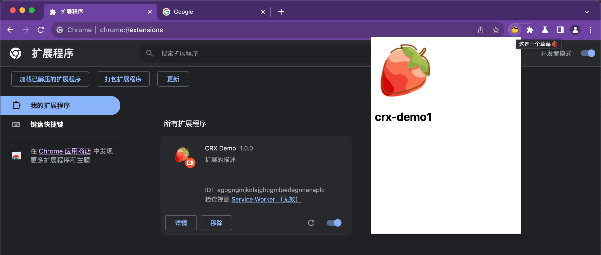

## `"devtools_page"`

**在 Chrome DevTools 开发者工具中增加一个新的面板**。像 Vue.js devtools 和 React Developer Tools 这两个扩展都是 devtools_page。

```json
"devtools_page": "devtools/index.html"
```

在每次开发者工具打开时 devtools_page 配置的 html 都将以 iframe 的形式加载。但注意，devtools_page 配置的 html 并不会展现在 DevTools 的 UI 界面。它的主要作用是用于加载所需要的 JavaScript 文件。

设置 devtools/index.html 的内容如下：

```html
<script src="./index.js"></script>
```

没错！什么也不需要，只需要一个 script 标签！

从下图可以看出，装载 devtools_page 的 iframe 被设置了 `display: none`

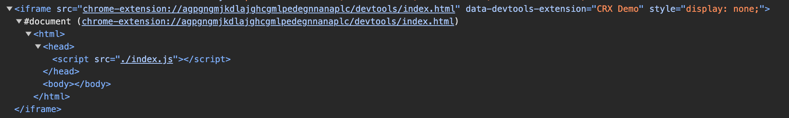

需要在 devtools/index.js 里调用 chrome.devtools.\* API 来创建 DevTools 面板：

```js
chrome.devtools.panels.create("My Devtools Panel", "", "devtools/panel.html")
```

没错！就这一行！此时 crx-demo/devtools 目录的结构如下：

```sh
devtools
├── index.html
├── index.js
└── panel.html
```

有必要说说 chrome.devtools.panels.create 的参数，

```js
chrome.devtools.panels.create(title, iconPath, pagePath)
```

- `title`： DevTools 工具栏上展示的名字，类似 Elements，Console，Network，Application 这些。
- `iconPath`：title 左边配置一个小 icon，**但但但！实际上 Chrome 会忽略这个参数！** 也就是根本设置不了小 icon，这个参数是废的，写死空字符串忽略就行啦。
- `pagePath`：这个才是真正的 DevTools 面板要显示的 HTML 页面，值得注意的是，**这个路径是相对于扩展根目录的**。它将以 iframe 的形式加载，如下图所示：
  
  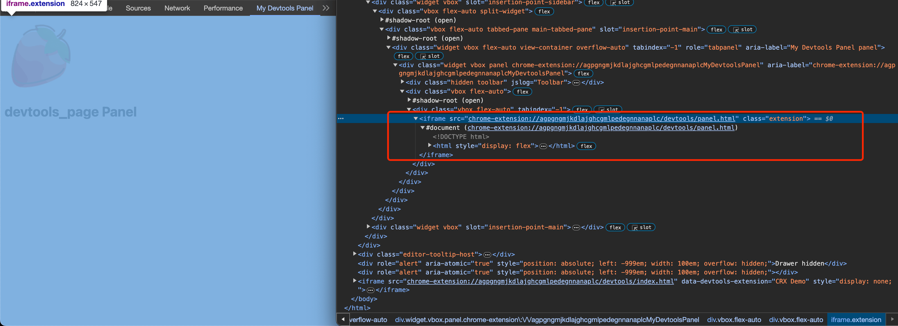

## `"side_panel"`

**在 Chrome 侧边栏配置一个新的页面**。侧边栏是浏览器级别的，常驻右侧。

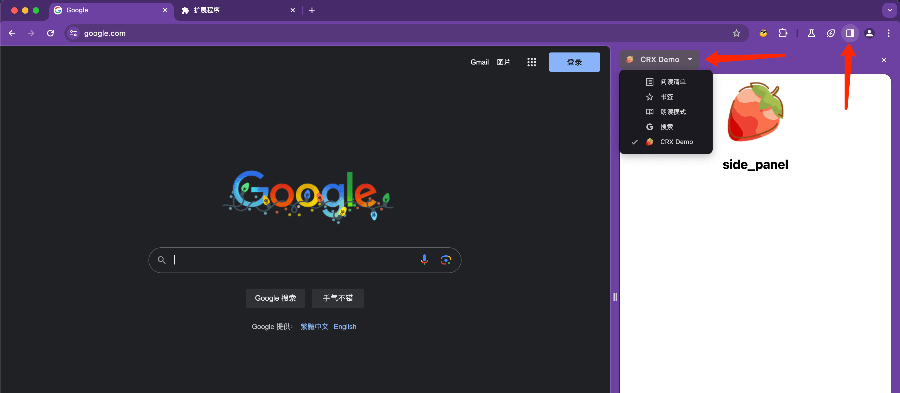

值得注意的是，**要求在 `"permissions"` 声明 `sidePanel` 权限**：

```json
"permissions": [
  "sidePanel"
]
"side_panel": {
  "default_path": "side_panel/index.html"
}
```

side_panel 页面里可以使用所有 chrome.\* API，尽情驰骋吧～

## `"options_page"`

**配置一个扩展选项页，供用户自定义扩展的功能选项**。

```json
"options_page": "options_page/index.html"
```

配置完之后会多出来两个入口，一个是右上角 action 按钮右键里的选项：

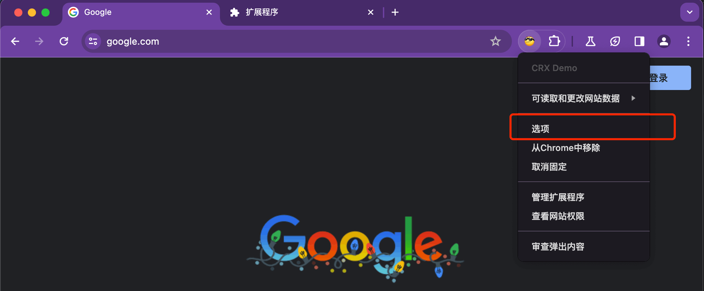

另一个是扩展详情页里的扩展程序选项：

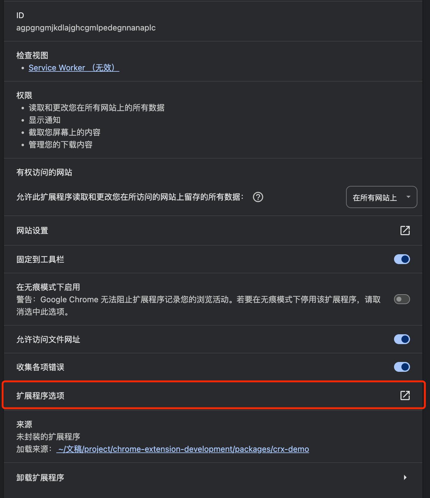

点击之后实际上就是新开一个浏览器页面打开扩展里的静态页面：

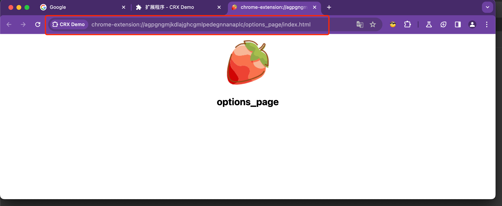

## `"chrome_url_overrides"`

**重写一些默认的 Chrome 页面**。

```json
"chrome_url_overrides" : {
  "PAGE_TO_OVERRIDE": "myPage.html"
}
```

`PAGE_TO_OVERRIDE` 的取值须为下列之一，也是目前支持重写的页面：

- `newtab`：新标签页。即 chrome://newtab

  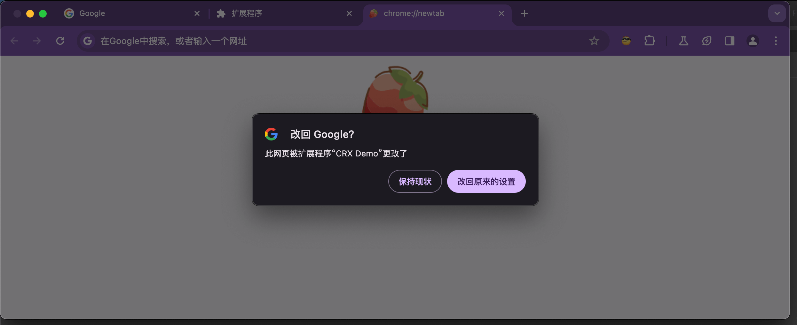

- `history`：浏览历史记录页面。即 chrome://history

  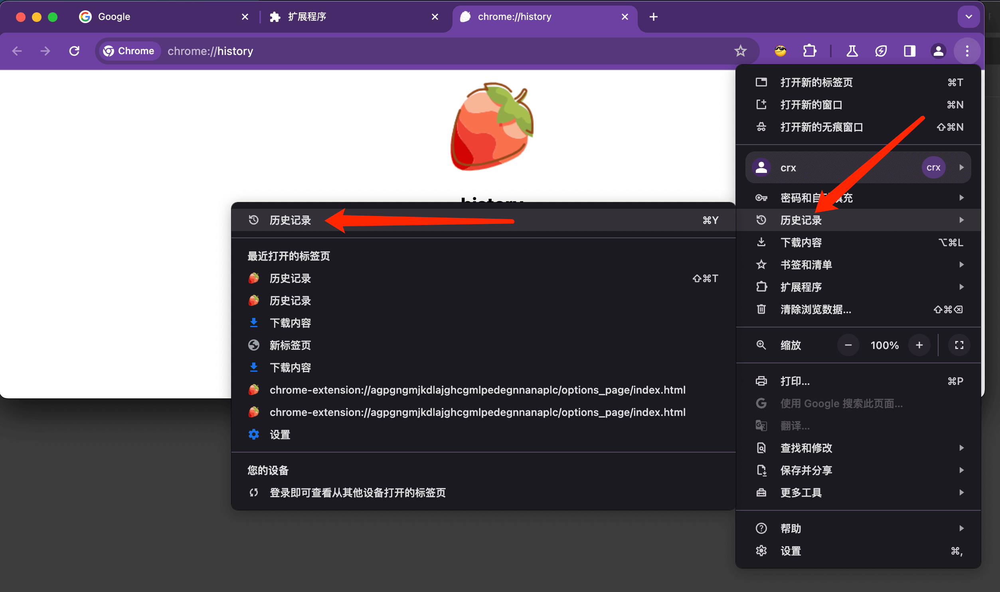

- `bookmarks`：书签管理页面。即 chrome://bookmarks

  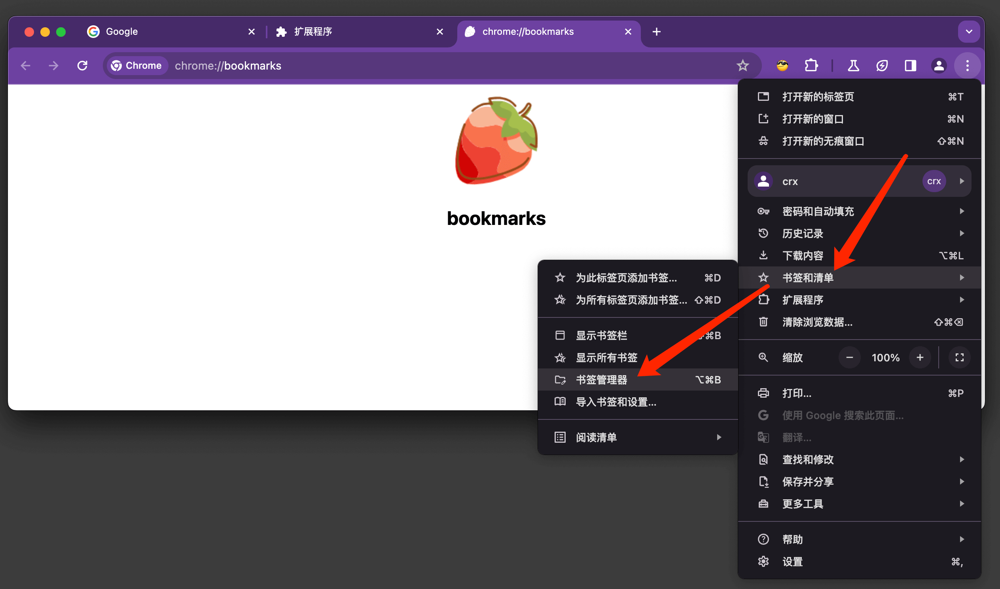

> 值得注意的是，一个扩展只允许重写一个页面，不能重写多个页面！

# 其他可选项

## `"declarative_net_request"`

`拦截和修改网络请求`。 不同于 manifest V2 编程式的操作处理，V3 规定必须使用声明式的静态规则进行配置。

## `"commands"`

`定义全局快捷键`。需要在 background service-worker 中监听并自定义处理逻辑。

```js
chrome.commands.onCommand.addListener((command) => {
  console.log(`Command: ${command}`)
})
```

## `"web_accessible_resources"`

**声明扩展里可以被外部 Web 页面或其他扩展访问的资源**。默认情况下扩展里的所有资源，包括 img，html，js，css 都不允许被外部访问，这是为了安全而刻意设计的。

## `"homepage_url"`

**指定关于该扩展的主页**。默认是指向 Chrome 应用商店，当你的扩展没放到 Chrome 应用商店，而是放在自己的网站上时可以用这个字段指明。
入口在扩展的详情页，如下图所示：

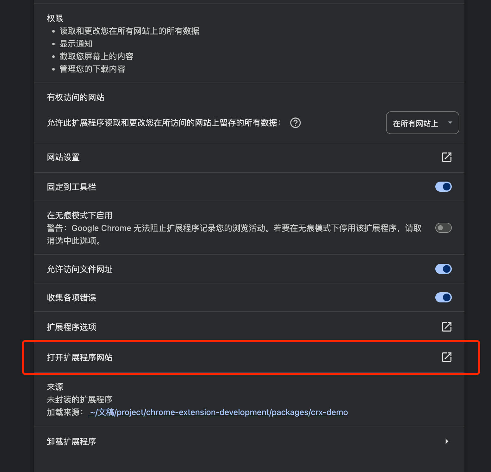

## `"author"`

**指明扩展的作者**。

```json
"author": {
  "email": "user@example.com"
}
```

值得注意的是，当往 Chrome 应用商店发布时，manifest.json 里指定的 author.email 地址必须和发布账户的一样！

# 总结

本篇介绍了 manifest.json 里剩余的一些可配置项：

- `"action"`
- `"devtools_page"`
- `"side_panel"`
- `"options_page"`
- `"chrome_url_overrides"`
- `"declarative_net_request"`
- `"commands"`
- `"web_accessible_resources"`
- `"homepage_url"`
- `"author"`

至此，Chrome 扩展 manifest 里常用的配置项全部介绍整理完毕。

文中涉及的 crx-demo 项目代码[已放在 GitHub](https://github.com/dom-bro/chrome-extension-development/tree/master/packages/crx-demo)。

觉得不错可以 [点个小星星](https://github.com/dom-bro/chrome-extension-development) 支持一下 🌹
