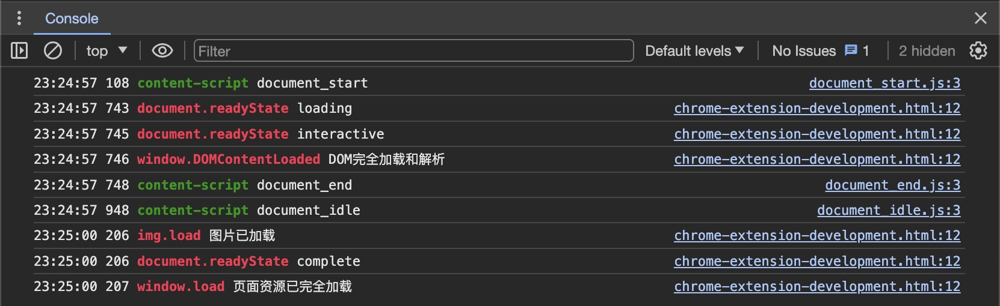
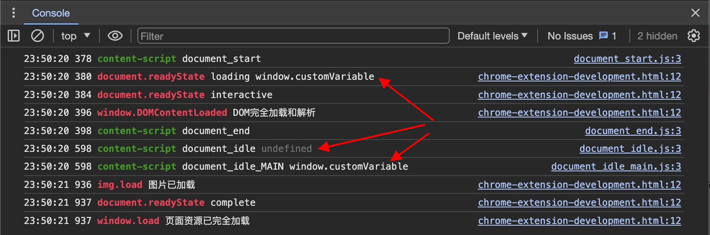

大家好，我是 dom 哥。我正在写关于 Chrome 扩展开发的系列文章，感兴趣的可以[点个小星星](https://github.com/dom-bro/chrome-extension-development)。

在[上一篇](../manifest上/index.md)中已经完成了 Chrome 扩展的雏形，本篇接着介绍 manifest 中的可选字段，完善扩展的细节。

## manifest 中的可选字段

### `"content_scripts"`

**向 web 页面注入 JavaScript 和 CSS**。当指定 content_scripts 后，每当页面加载时，content_scripts 也将随之加载。

```json
"content_scripts": [
   {
     "css": ["content-style.css"],
     "js": ["content-script.js"],
     "matches": ["<all_urls>"],
     "run_at": "document_idle", // optional
     "world": "ISOLATED" // optional
   }
 ]
```
content_scripts 里的配置项解释：
- `"css"`：指定注入的 css 样式文件
- `"js"`：指定注入的 js 脚本文件
> 值得注意的是，**css 和 js 指定的文件路径必须是相对路径**！总是相对于扩展根目录！
- `"matches"`：用于指定往哪些页面注入 css 和 js，必填项。

  其值并非普通的 url，而是满足如下结构的匹配模式。
  ```html
  <scheme>://<host>/<path>
  ```
  `scheme`：指明协议格式，只能是以下几种
  - http
  - https
  - 通配符 `*`, 表示 http 或 https
  - file
  
  `host`：指明主机名。支持通配符 `*`，但有限制，通配符 `*` 的屁股后面必须跟 `.` 或 `/`！也就是只有以下两种使用方式
  - `*.example.com` 匹配子域
  - `*/` 匹配所有域
  
  `path`：指明匹配的网址路径。`/*` 表示匹配所有路径。

  **特殊 case**：
  - `"<all_urls>"` 匹配所有页面！一般，额，简单粗暴，就用这个😅！

- `"run_at"`：注入时机。默认情况下，扩展会在页面处于空闲状态时注入 css 和 js。有以下3个时机可供选择：
  - `document_start` 页面 html 开始加载前就注入。此时 DOM 树还未建立！ 
  - `document_end` window DOMContentLoaded 事件触发后注入。此时 DOM 树已建立，但图片，字体，脚本等资源尚未加载完毕。
  - `document_idle` 当页面空闲时注入。这也是默认的注入时机。

  下面这张图片可以直观的看出注入时机和页面加载状态的先后时间顺序。
  
  

- `"world"`：content-script 的脚本执行环境。默认情况下，content-script 运行在一个隔离的沙箱环境中。这意味着和页面的运行时环境是隔离开来的两个独立环境，最明显的表现就是两个环境里的 全局变量 `window` 不通。该字段有以下2个选择：
  - `ISOLATED` 隔离沙箱环境。这也是默认的 content-script 执行环境。
  - `MAIN` 页面运行时环境。这意味者扩展脚本和页面脚本共享运行时，同一个 window，同一个世界，同一个梦想。
  
  假设页面 js 给 `window` 对象增加了一个 `customVariable` 全局变量，
  ```html
  <script>
    window.customVariable = "window.customVariable"
  </script>
  ```
  下面是 content-script 在 `ISOLATED` 和 `MAIN` 环境中打印`window.customVariable` 变量的结果：

  