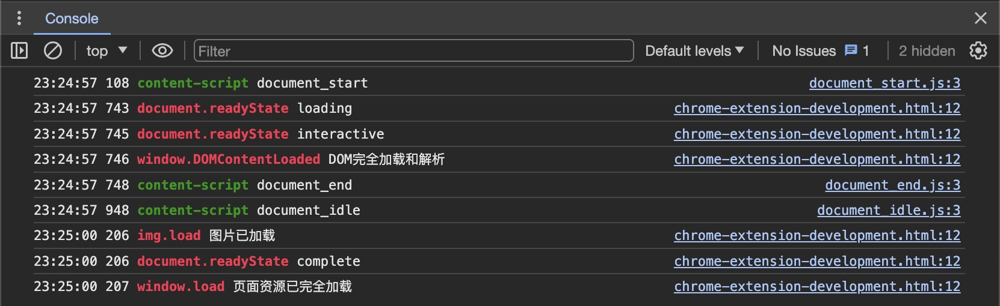
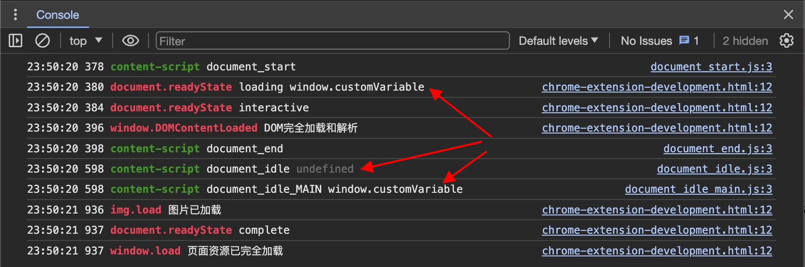
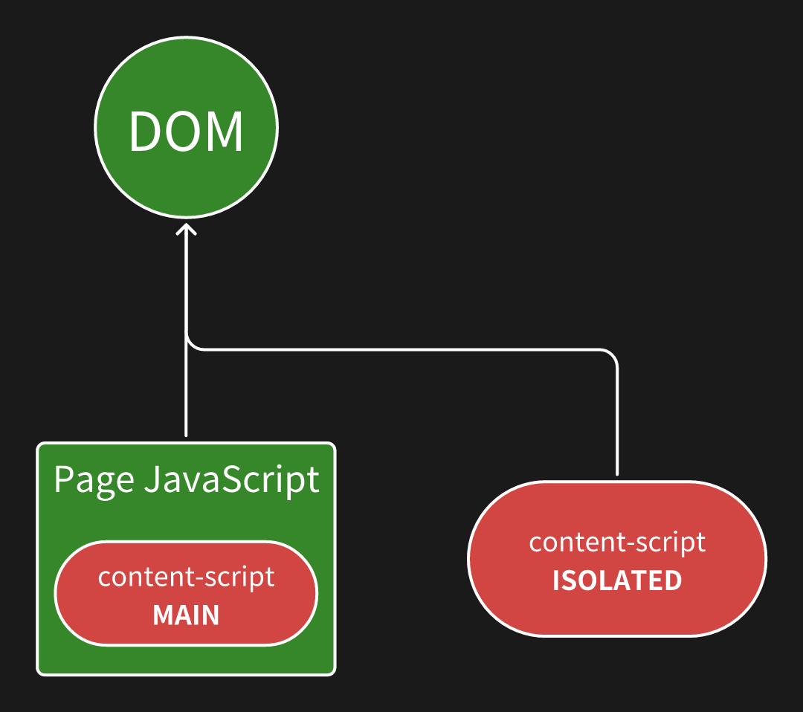
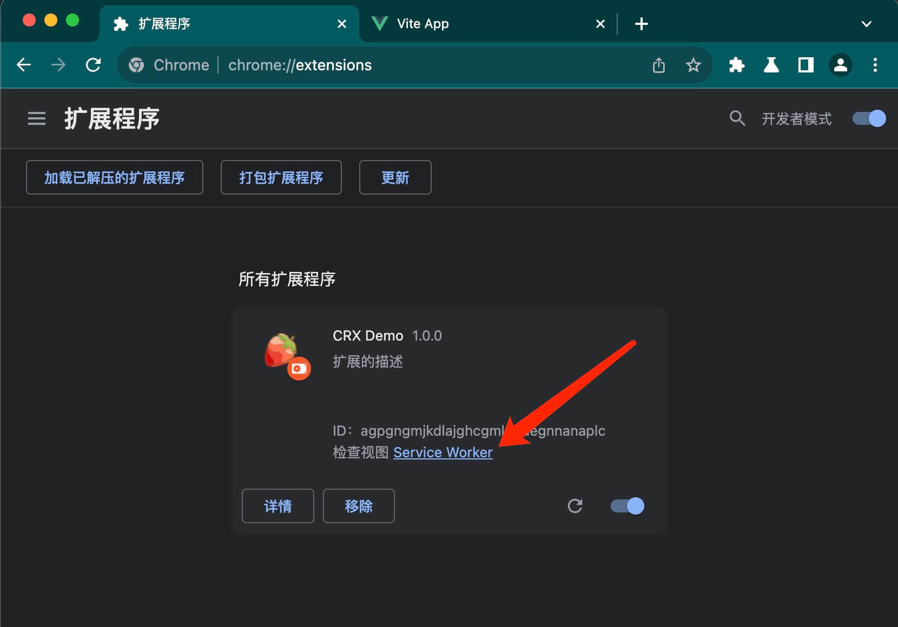
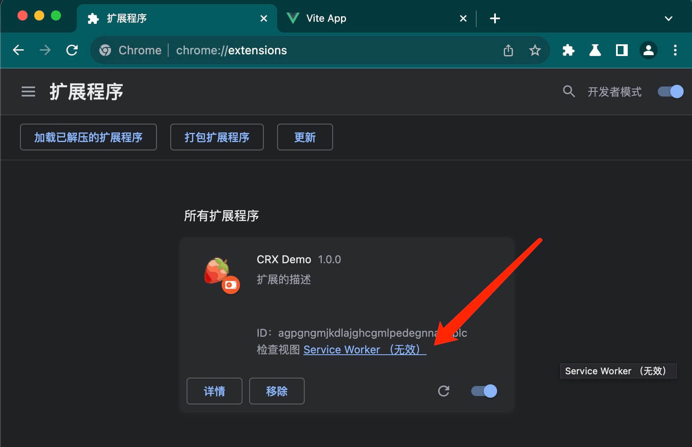

大家好，我是 dom 哥。我正在写关于 Chrome 扩展开发的系列文章，感兴趣的可以 [点个小星星 ](https://github.com/dom-bro/chrome-extension-development)。

在[上一篇](../manifest上/index.md)中已经完成了 Chrome 扩展的雏形，本篇接着介绍 manifest 中的可选字段，完善扩展的细节。

## manifest 中的可选字段

### `"content_scripts"`

**向 web 页面注入 JavaScript 和 CSS**。可以说这是 Chrome 扩展的灵魂。当指定 content_scripts 后，每当页面加载时，content_scripts 也将随之加载。

```json
"content_scripts": [
   {
     "css": ["content-style.css"],
     "js": ["content-script.js"],
     "matches": ["<all_urls>"],
     "run_at": "document_idle", // optional
     "world": "ISOLATED" // optional
   }
 ]
```
content_scripts 里的配置项解释：
- `"css"`：指定注入的 css 样式文件
- `"js"`：指定注入的 js 脚本文件
> 值得注意的是，**css 和 js 指定的文件路径必须是相对路径**！总是相对于扩展根目录！
- `"matches"`：用于指定往哪些页面注入 css 和 js，必填项。

  其值并非普通的 url，而是满足如下结构的匹配模式。
  ```html
  <scheme>://<host>/<path>
  ```
  `scheme`：指明协议格式，只能是以下几种
  - http
  - https
  - 通配符 `*`, 表示 http 或 https
  - file
  
  `host`：指明主机名。支持通配符 `*`，但有限制，通配符 `*` 的屁股后面必须跟 `.` 或 `/`！也就是只有以下两种使用方式
  - `*.example.com` 匹配子域
  - `*/` 匹配所有域
  
  `path`：指明匹配的网址路径。`/*` 表示匹配所有路径。

  **特殊 case**：
  <!-- https://developer.chrome.com/docs/extensions/develop/concepts/match-patterns -->
  - `"<all_urls>"` 匹配所有页面！一般，额，简单粗暴，就用这个😅！

- `"run_at"`：**脚本注入时机**。默认情况下，扩展会在页面处于空闲状态时注入 css 和 js。有以下3个时机可供选择：
  - `document_start` 页面 html 开始加载前就注入。此时 DOM 树还未建立！ 
  - `document_end` window DOMContentLoaded 事件触发后注入。此时 DOM 树已建立，但图片，字体，脚本等资源尚未加载完毕。
  - `document_idle` 当页面空闲时注入。这也是默认的注入时机！浏览器会在 `document_end` 和 `window.onload` 触发前这个时间段内选择时机注入，具体注入时机取决于页面的复杂程度。

  下面这张图片可以直观的看出注入时机和页面加载状态的先后时间顺序。🟥 红色字是页面内脚本打印，🟩 绿色字是扩展 content-script 打印。
  
  

- `"world"`：**content-script 的脚本执行环境**。默认情况下，content-script 运行在一个隔离的沙箱环境中。这意味着和页面的运行时环境是隔离开来的两个独立环境，最明显的表现就是两个环境里的 全局变量 `window` 不通。该字段有以下2个选择：
  - `ISOLATED` 隔离沙箱环境。这也是默认的 content-script 执行环境。
  - `MAIN` 页面运行时环境。这意味者扩展脚本和页面脚本共享运行时，同一个 window，同一个世界，同一个梦想。
  
  理解两者的不同非常重要！假设页面上的 js 给 `window` 对象增加了一个 `customVariable` 全局变量，
  ```html
  <head>
    <script>
      window.customVariable = "window.customVariable"
    </script>
  </head>
  ```
  下面是扩展的 content-script 在 `ISOLATED` 和 `MAIN` 两个不同的环境中打印 `window.customVariable` 变量的结果：

  

  可以发现 `ISOLATED` 隔离环境访问不到 `window.customVariable`，值是 undefined，而 `MAIN` 环境则能访问到！

  我画了一张图，以便直观的展示 `ISOLATED` 和 `MAIN` 执行环境的区别

  

### `"background"`

**注册一个 service worker 作为后台服务**。`"content_scripts"` 是页面级别的脚本，运行于前台页面，随页面销毁。`"background"` 是浏览器级别的服务，可以长期运行于后台，但事情也并没有那么简单，Chrome 扩展的 service worker 会在需要时自动加载，在闲置时自动休眠。

作为后台服务，service worker 的主要用途是注册事件监听，响应各种事件，比如网络请求，content_scripts 传来的 message 等等。Chrome 扩展提供了大量 chrome.* 接口可供使用，这些接口大多都能在 `"background"` 中使用，但 `"content_scripts"` 只能使用其中的少数，这是为安全起见故意设计的。

```json
"background": {
  "service_worker": "service-worker.js",
  "type": "module"
}
```

不同于 `"content_scripts"` 可以用数组指定多个，`"background"` 只支持设置一个。
- `type`：指明支不支持 ES Modules，只有 `module` 一个值，加上就支持 import，不加上就不支持！

配置完 `"background"` 后在扩展管理里更新扩展，就能看到注册的 Service Worker 啦！



当 service worker 闲置时，它会自动休眠，显示为**无效**。如下图所示：



### `"permissions"`

**明确申明你的扩展需要用到哪些特殊的扩展 APIs**，就像手机 App 询问网络权限，位置权限，照片权限等等。权限和 API 绑定，每个权限被授权后都将解锁一批 API。有些权限只需要申明，浏览器就会授予权限，而有些权限还将展示警示弹窗需要用户明确授权才行。

举几个例子：
- `"webRequest"`，获得访问 `chrome.webRequest` API，可以监控所有网络流量。
- `"cookies"`，获得访问 `chrome.cookies` API，可以操作网站 cookie
- `"bookmarks"`，获得访问 `chrome.bookmarks` API，可以读写管理书签
- `"desktopCapture"`，获得访问 `chrome.desktopCapture` API，可以进行窗口或页面的截图
- `"downloads"`，获得访问 `chrome.downloads` API，可以操作和管理浏览器下载

截至目前，crx-demo 项目的目录结构如下：
```sh
crx-demo
├── background
│   ├── service-worker.js
│   └── sub.js
├── content-scripts
│   ├── document_end.css
│   ├── document_end.js
│   ├── document_idle.css
│   ├── document_idle.js
│   ├── document_idle_main.js
│   ├── document_start.css
│   └── document_start.js
├── icon128.png
├── icon48.png
└── manifest.json
```
已经可以在 content-script 和 background 里任意编写代码来实现自己匪夷所思的奇思妙想啦！

[crx-demo 项目已经放在 github 上啦](https://github.com/dom-bro/chrome-extension-development/tree/master/packages/crx-demo)，后续会继续更新丰富细节。

本篇就介绍到这里，下篇接着将把剩余的 manifest 重要选项整理完。

觉得不错可以 [点个小星星 ](https://github.com/dom-bro/chrome-extension-development) 支持一下🌹