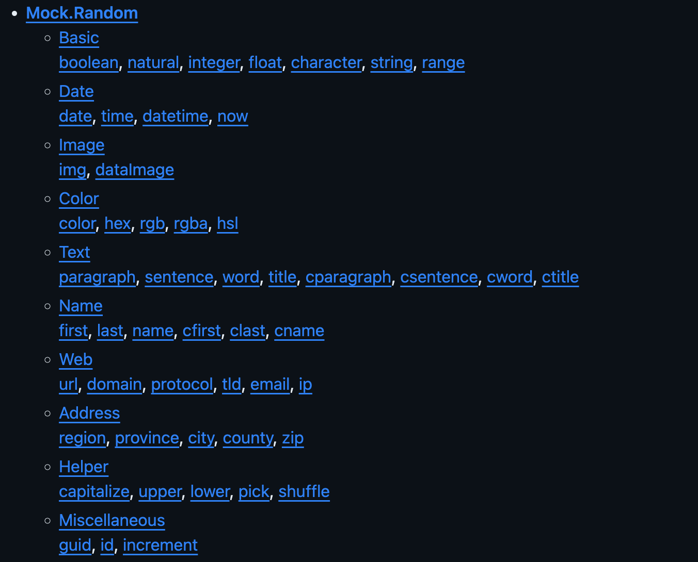
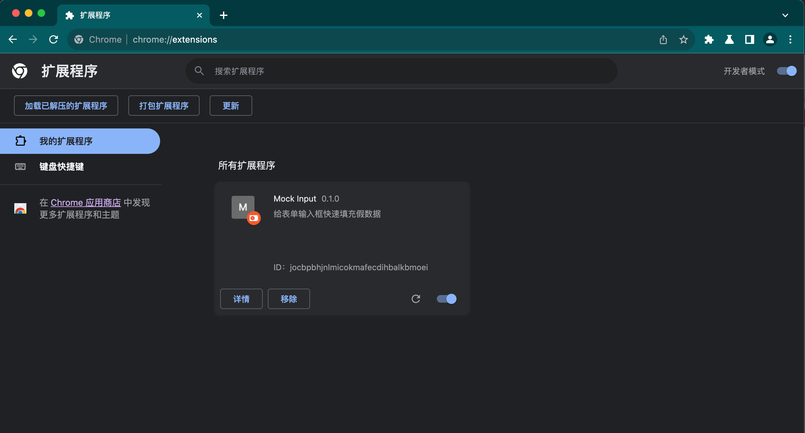
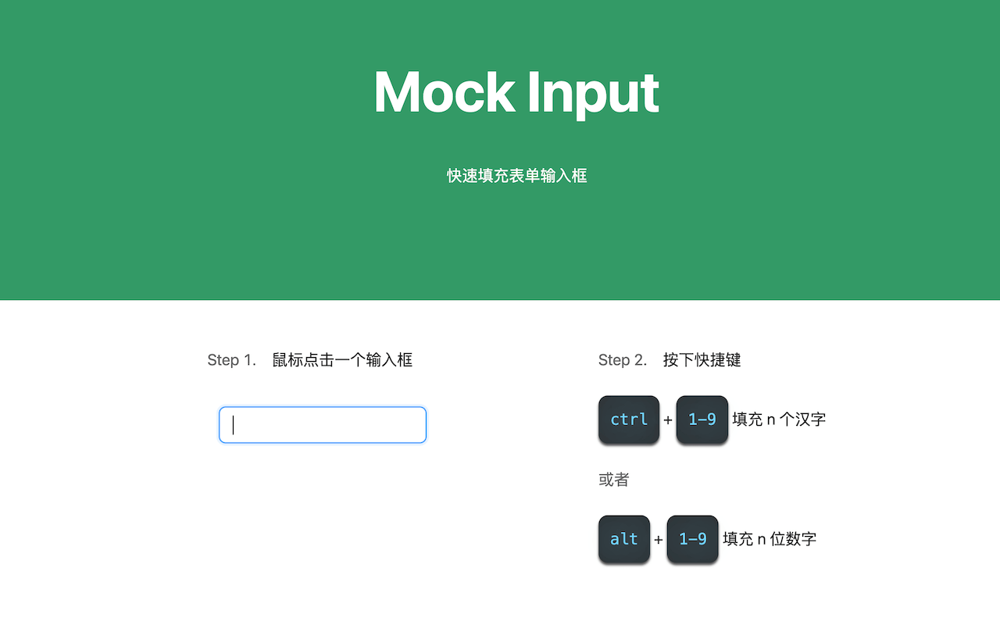

大家好，我是 dom 哥。我正在写关于 Chrome 扩展开发的系列文章，感兴趣的可以 [点个小星星 ](https://github.com/dom-bro/chrome-extension-development)。

填表单是打工人经常面对的场景，作为一个前端，我经常开发一些PC端的页面，它们主要由表单和表格构成，而输入框又是表单里最常见的表单项。

接下来就试着做一个简单的小扩展，用于快速给表单里的输入框填充值。

# Mock.js
开始前请先让我介绍一下 [Mock.js](https://github.com/nuysoft/Mock)，这是一个模拟数据生成器，也正是这个库给了我灵感。

简而言之，Mock.js 可以生成各种各样数据类型的假数据。Chrome 扩展要做的事就是把生成的假数据插到输入框里。



# 新建项目

从零开始新建一个项目，暂且命名为 mock-input-demo，在项目里新建一个 manifest.json 文件，此时项目目录结构应该如下：
```sh
mock-input-demo
└── manifest.json
```
manifest 先简单配置一下基础字段：
```json
{
  "manifest_version": 3,
  "name": "Mock Input",
  "version": "0.1.0",

  "description": "给表单输入框快速填充假数据"
}
```

打开 chrome://extensions 扩展程序页面 **加载已解压的扩展程序**，选中 mock-input-demo，可以看到扩展出来了🎉



自己设计了一个简单 logo 😬，配置上去


```diff
+ "icons": {
+   "48": "logo48.png"
+ }
```
给输入框填充值的逻辑需要放在 content-script 里，新建一个 content-script.js 文件，在 manifest.json 中配置上：

```diff
+ "content-scripts": [
+   {
+     "js": ["content-script.js"],
+     "matches": ["<all_urls>"]
+   }
+ ]
```
此时项目的结构应该如下：

```sh
mock-input-demo
├── content-script.js
├── logo48.png
└── manifest.json
```

# 引入 Mock.js
由于项目未做工程化，所以 content-script.js 不支持 ES Modules，关于 Chrome 扩展项目的工程化，后面会单独讨论 🧐。这里暂且先从 jsDelivr 下载一份最新的 mock.min.js 放在项目里，直接放在 content-script 里注入：
```diff
- "js": ["content-script.js"],
+ "js": [
+   "mock.min.js",
+   "content-script.js",
+ ],
```
mock.min.js 会暴露全局变量 `Mock`，在 content-script.js 可以直接使用

# 填充输入框

万事具备，可以编写逻辑代码啦！

简单起见，这里只考虑 input 和 textarea 两种输入框类型，以下代码实现两种场景：
- 按下 <kbd>ctrl</kbd> + <kbd>1-9</kbd> 时填充 n 个汉字
- 按下 <kbd>alt</kbd> + <kbd>1-9</kbd> 时填充 n 位数字

核心代码如下：
```js
const { Random } = Mock

window.addEventListener('keypress', e => {
  const { target } = e
  if (['INPUT', 'TEXTAREA'].includes(target.tagName)) {
    let insert
    let num
    if (e.code.startsWith('Digit')) {
      num = parseInt(e.code.replace('Digit', ''))
    }
    if (e.ctrlKey) {
      if (num != null) {
        insert = Random.ctitle(num)
      }
    } else if (e.altKey) {
      if (num > 0) {
        insert = Random.natural(Math.pow(10, num - 1), Math.pow(10, num) - 1)
      }
    }

    if (insert) {
      e.preventDefault()

      const before = target.value.substr(0, target.selectionStart)
      const after = target.value.substr(target.selectionEnd)
      target.value = before + insert + after
      const cursorPosition = (before + insert).length
      target.setSelectionRange(cursorPosition, cursorPosition)

      target.dispatchEvent(new InputEvent('input'))
    }
  }
})
```

好了，更新一下扩展，找个有输入框的页面，试试吧！



文中设计的[项目源码已放在 GitHub](https://github.com/dom-bro/chrome-extension-development/tree/master/packages/mock-input-demo)

觉得不错可以 [点个小星星 ](https://github.com/dom-bro/chrome-extension-development) 支持一下🌹