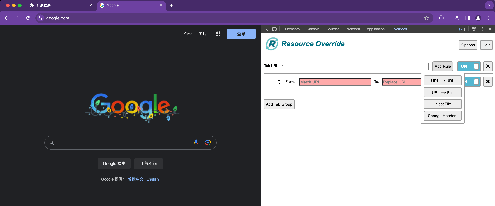

大家好，我是 dom 哥。这是我关于 Chrome 扩展开发的系列文章，感兴趣的可以 [点个小星星](https://github.com/dom-bro/chrome-extension-development)。

工欲善其事，必先利其器。Chrome 可能是前端开发中使用最多的浏览器。在日常开发中，下列几款 Chrome 扩展也许能让你的开发工作事半功倍 🚀

# [Vue.js devtools](https://chromewebstore.google.com/detail/vuejs-devtools/nhdogjmejiglipccpnnnanhbledajbpd) ⚙️

vue 官方专为 vue 应用开发的调试工具。

通过使用它，你可以快速查看组件的状态和属性，分析性能瓶颈，并进行性能优化。同时，它还提供了方便的 Vuex 状态管理和组件时间旅行功能。无论你是 Vue.js 初学者还是有经验的开发人员，Vue.js Devtools 都是一个值得掌握的工具。

# [React Developer Tools](https://chromewebstore.google.com/detail/react-developer-tools/fmkadmapgofadopljbjfkapdkoienihi) ⚙️

React Developer Tools 专为 React 应用程序开发者设计。它提供了一系列功能，帮助开发者更轻松地调试和优化 React 组件。

通过深入掌握 React Developer Tools，你可以更好地理解组件层次结构、跟踪组件状态和性能，调试 React Hooks，以及进行组件时间旅行等操作。无论你是初学者还是有经验的开发者，掌握 React Developer Tools 都将极大地提升你的 React 开发能力和效率。

# [Vimium](https://chrome.google.com/webstore/detail/dbepggeogbaibhgnhhndojpepiihcmeb) 🚀

将 Vim 式的快捷键带入浏览器世界。

Vimium 为用户提供了类似 Vim 编辑器的键盘导航和操作方式，大大提升了浏览器操作的效率和速度。通过安装和使用 Vimium，你可以像在 Vim 中一样快速浏览网页、打开链接、搜索内容，甚至进行高级操作和自定义设置。不管你是 Vim 用户还是想要提高浏览器操作效率的用户，Vimium 都值得一试。

# [Resource Override](https://chromewebstore.google.com/detail/pkoacgokdfckfpndoffpifphamojphii) 🔀
Resource Override 提供了实时修改，重定向和调试网页静态资源的能力。

前端开发者经常需要将线上资源重定向到本地，以此实现本地开发调试，这正是 Resource Override 的用武之地。

通过使用 Resource Override，我们可以定制和优化网页资源加载，满足个性化需求，或进行调试和优化。不论是开发者还是调试专家，Resource Override 都是一个不可或缺的工具，能够显著提升开发和调试效率。

# [GoFullPage - Full Page Screen Capture](https://chromewebstore.google.com/detail/gofullpage-full-page-scre/fdpohaocaechififmbbbbbknoalclacl) 📸

简单快速生成网页全页截图的高效工具。

下面是我截的 github 首页长图：

我们经常需要生成网页的全页截图，以便进行展示、分享、文档编写或错误排查。GoFullPage 就是这样一款强大而高效的网页截图工具，能够快速生成高质量的网页全页截图。它提供了多种截图模式、定制化设置和高性能算法，帮助开发者、设计师和测试人员更轻松地进行网页截图工作。无论是展示、分享、文档编写还是错误排查，GoFullPage 都能为你提供便捷而优质的截图体验。

觉得不错可以 [点个小星星](https://github.com/dom-bro/chrome-extension-development) 支持一下哦 🌹
