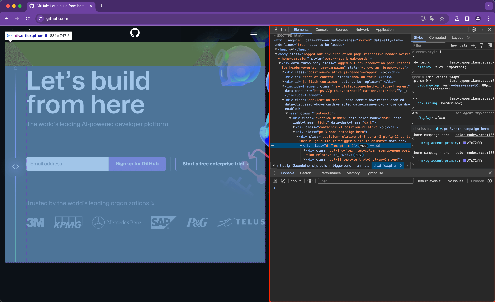
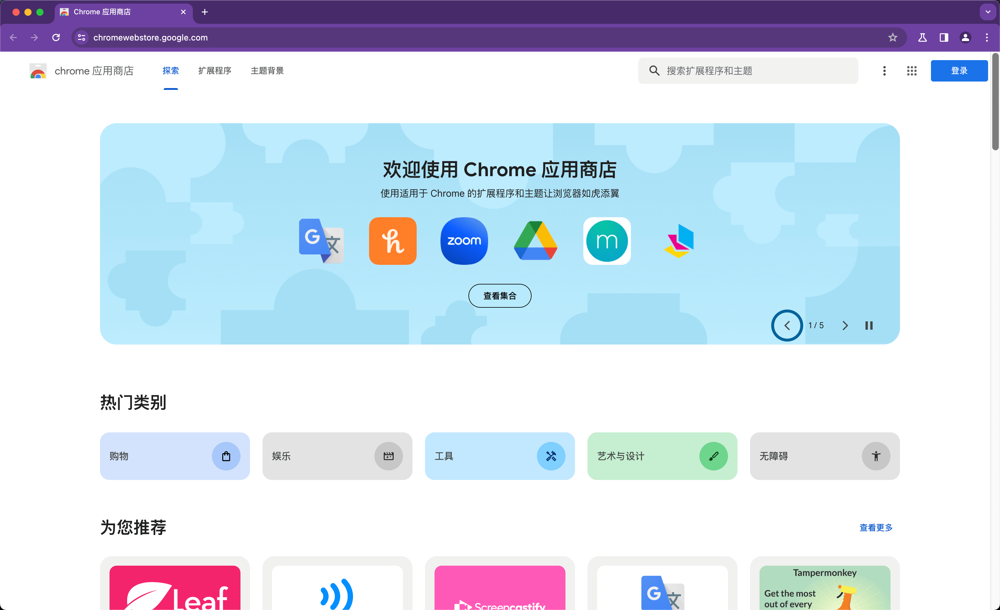
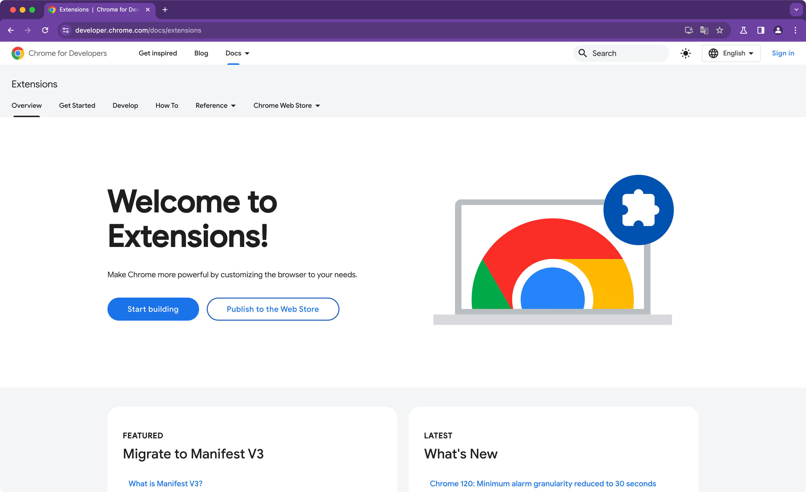

大家好，我是 dom 哥。这是我关于 Chrome 扩展开发的系列文章，感兴趣的可以 [点个小星星](https://github.com/dom-bro/chrome-extension-development)。

# 浏览器现状 🌍

研究机构 Statcounter 发布了 2023 年 9 月报告，揭示了有关浏览器的最新统计数据。

| 浏览器  | 市场份额 | Chromium-based? |
| ------- | -------- | --------------- |
| Chrome  | 63.56%   | Yes             |
| Safari  | 19.85%   | No              |
| Edge    | 5.43%    | Yes             |
| Firefox | 2.94%    | No              |
| Opera   | ...      | Yes             |

可以看到基于 Chromium 的浏览器占了全球市场的 7 成！

对于前端开发来说，Chrome 更是形影不离的饭碗级软件 😁。既然 Chrome 这么重要，那么把它研究透一定大有裨益。

在我看来，Chrome 值得深入研究的地方早有两块：DevTools 和 Extension。

先说说 **DevTools**，即开发者工具，是 Chrome 为我们提供的一套功能强大的集开发，调试， 分析诸多功能于一身的内置工具。如下图所示：

像 Elements，Console，Sources， Network，Application 这些都是日常开发调试离不开的功能面板。但是我们开发者对 DevTools 的主要研究内容是**怎么用**。因为这些强大的功能面板都是 Chrome 内置的，作为开发者使用者，只能用，不能动代码。

然后是 **Extension**，即 Chrome 扩展，是留给广大开发者自由发挥的天地。

- 想给一些页面注入 js，css？
- 想跨浏览器的页签运行一个后台服务？
- 想自定义新打开的标签页？
- 想实现什么天马行空的想法？

这些都可以通过 Chrome 扩展实现！Chrome 为扩展程序提供了大量 `chrome.*` API 用于开放 Chrome 的能力。

大家开发的扩展可以发布到 Chrome 应用商店供海量用户选择，就像苹果的 App Store 一样！

Chrome 应用商店如下图：

甚至，如果天时地利人和，你甚至可以通过 Chrome 扩展赚点零花钱 💰 也不是不可能，不过别抱太大希望哦 😅

# Chrome 扩展开发 🛠️

学习一门技术，最好的方式就是去官网，看官方文档，跟着官方文档边看边练，这是不会错的路子。

Chrome Extension 也不例外。Chrome 官方为其扩展开发提供了详尽的文档，奈何，全是英文啊～，看的我四级词汇都不够用了：

不但有文档，每个功能特性都提供了[示例代码](https://github.com/GoogleChrome/chrome-extensions-samples)，简直不要太贴心～

# 总结，梳理，写系列教程 📚

记得刚接触到 Chrome Extension 时它还是 manifest V2 版本，当时是想做一个 Chrome 扩展，通过拦截网络请求修改其 header 突破跨域限制。时过境迁，如今已是 manifest V3 版本，Chrome 对 webRequest 的细则已做了调整，当初写的代码即将不再支持运行 🥹。

还折腾过一个录制页面操作的扩展，记录下鼠标点击和表单输入等操作，可以重放，模拟这些操作再还原页面状态。后来清理磁盘，居然 TMD 手贱把项目清理掉了，大腿拍青，切记 git push 大于天啊！如今 Chrome 已经有了 Recorder 工具，和我当时的目标类似，只不过我当时的做法是直接用 content_scripts 在页面上重放，而不是在 Puppeteer 里去重放。

期间还为了各种小用途开发过十几个功能不一的扩展程序。现在主要是维护一个辅助日常开发，和业务高耦合的扩展。

但，几年下来，虽写了不少扩展程序，但总感觉零碎，所以我决定把有关 Chrome 扩展开发的东西系统的梳理总结起来，通过沉淀成一份系列教程，建立起知识体系，成为自己的核心竞争力。

目前心中的大纲简单罗列如下，勾上的是已完成的：

- [x] Chrome扩展的核心：manifest 文件（上）
- [x] Chrome扩展的核心：manifest 文件（中）
- [x] Chrome扩展的核心：manifest 文件（下）
- [x] Chrome扩展开发实战：快速填充表单
- [x] 打造一个极度舒适的Chrome扩展项目开发环境
- [ ] Chrome扩展开发中的消息通信
- [x] 推荐给前端开发的 5 款 Chrome 扩展 🚀
- [ ] Chrome扩展开发系列完结篇

后续慢慢完善吧，轮廓已成，细节可以慢慢雕琢。

Chrome 扩展开发似乎是个冷门，不过也可以理解，对前端开发来说，这属于一种有了更好，没有也罢的技术，就算不助我开发，也不影响我开发😂。不管怎么样，我都想坚持下去，其实我现在是奔着写一本小册的标准去的，说不定未来某天我真的会出本小册。毕竟 35 岁危机不是闹着玩儿的，提前搞搞副业总是好的，加油哟～

觉得不错可以 [点个小星星](https://github.com/dom-bro/chrome-extension-development) 支持一下哦 🌹
