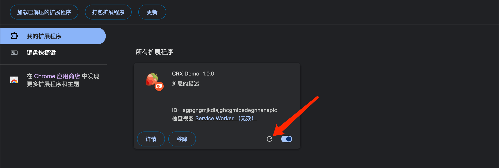
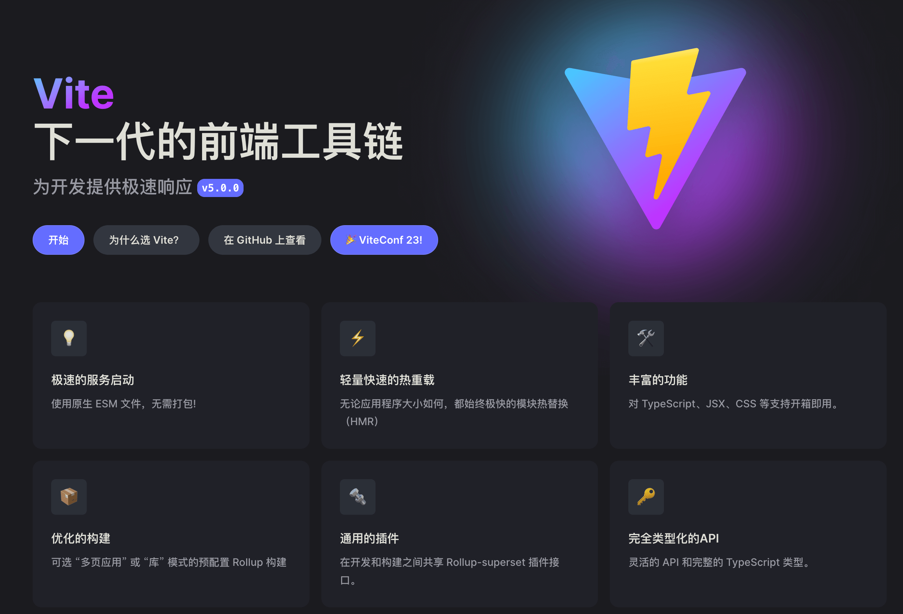

大家好，我是 dom 哥。这是我关于 Chrome 扩展开发的系列文章，感兴趣的可以 [点个小星星](https://github.com/dom-bro/chrome-extension-development)。

Chrome 扩展能够提高浏览器的使用体验，通过自定义 UI 界面，监听浏览器事件，改变 Web 页面等操作来延展浏览器的功能。

Chrome 扩展项目使用前端 html，css，js 基础技术开发，一大痛点就是改动代码后的扩展更新问题，先来看一看 Chrome 扩展的更新逻辑：

| 扩展各部分                 | 是否需要更新扩展            |
| -------------------------- | --------------------------- |
| manifest.json              | Yes                         |
| background service worker  | Yes                         |
| content scripts            | Yes (并且需要刷新 Web 页面) |
| action popup               | No                          |
| options page               | No                          |
| Other extension HTML pages | No                          |

更新 Chrome 扩展意味着需要打开扩展管理界面（chrome://extensions），点击扩展的更新按钮，如下图：



如果每次改动代码，都需要这样操作一遍，才能看到效果，那也太痛苦了吧 😖，尤其是 content scripts，更新完扩展后还要去浏览器页签刷新页面，这极大的拉低开发效率和消磨人的耐心。

仔细想想想，目前前端项目开发已经有 HMR 热重载技术，在开发 Web 页面时可以实时查看效果，极大的提升了开发体验。那么，能否把这种极致的体验带到 Chrome 扩展开发中来呢？经过多番折腾探索，还真让我搞出来啦 🚀

# 感谢 [vite](https://cn.vitejs.dev/)

vite 作为下一代的前端工具链，用过的都说好 👍。



vite 为各种技术栈提供了模板：

| JavaScript | TypeScript |
| ---------- | ---------- |
| vue        | vue-ts     |
| react      | react-ts   |
| vanilla    | vanilla-ts |
| preact     | preact-ts  |
| lit        | lit-ts     |
| svelte     | svelte-ts  |
| solid      | solid-ts   |
| qwik       | qwik-ts    |

vite 生成的项目将开箱支持：

- ✅ TypeScript
- ✅ html 的 HMR

用 vite 新建一个 Chrome 扩展项目，其 HMR 支持情况将如下：

| 扩展各部分                 | 是否需要更新扩展            | HMR |
| -------------------------- | --------------------------- | --- |
| manifest.json              | Yes                         |
| background service worker  | Yes                         |
| content scripts            | Yes (并且需要刷新 Web 页面) |
| action popup               | No                          | ✅  |
| options page               | No                          | ✅  |
| Other extension HTML pages | No                          | ✅  |

# 感谢 [@crxjs/vite-plugin](https://crxjs.dev/vite-plugin/)

@crxjs/vite-plugin 是一个 vite 插件，旨在帮助开发者使用现代 web 开发技术开发 Chrome 扩展。

使用起来也是非常简单：

```sh
npm i @crxjs/vite-plugin@beta -D
```

在 vite.config.ts 中增加如下配置：

```js
import { defineConfig } from "vite"
import { crx } from "@crxjs/vite-plugin"
import manifest from "./manifest"

export default defineConfig({
  plugins: [crx({ manifest })],
})
```

@crxjs/vite-plugin 通过解析 manifest 清单文件，找到扩展里相关的所有文件资源进行编译打包。

在配置完之后，项目将获得以下特性：

- manifest 不再须要是 json 文件，可以是 js 或 ts 文件！简直不要太方便 🚀
- 全方位 HMR
  
  | 扩展各部分                 | 是否需要更新扩展            | HMR |
  | -------------------------- | --------------------------- | --- |
  | manifest.json              | Yes                         | ✅
  | background service worker  | Yes                         | ✅
  | content scripts            | Yes (并且需要刷新 Web 页面) | ✅
  | action popup               | No                          | ✅  |
  | options page               | No                          | ✅  |
  | Other extension HTML pages | No                          | ✅  |


> demo 项目源码 [create-crx](https://github.com/dom-bro/chrome-extension-development/tree/master/packages/create-crx) 我已经放在 GitHub 上，觉得不错可以 [点个小星星](https://github.com/dom-bro/chrome-extension-development) 支持一下哦 🌹
