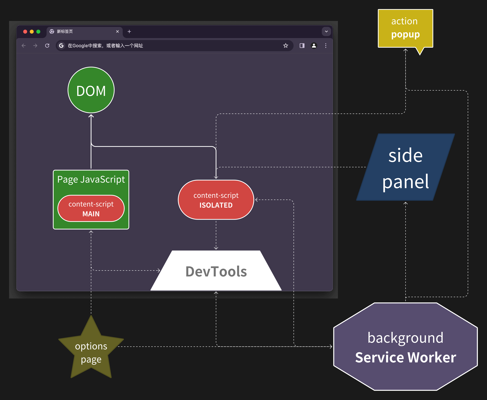

大家好，我是 dom 哥。这是我关于 Chrome 扩展开发的系列文章，感兴趣的可以 [点个小星星](https://github.com/dom-bro/chrome-extension-development)。

一个复杂的 Chrome 扩展程序通常由 `content_scripts`，`background`，`action popup`，`side panel`，`options page` 等部分组成，这些部分所负责的功能各不相同，所处的运行环境各不相同，所能访问的 `chrome.*` API 也各不相同，也因此经常需要通信告诉对方需要做什么。

下面是我画的一张图，简单说明各部分关系：

Chrome 提供了两种通信 API：
- 一种是一次性请求（one-time requests），一次发一条消息，类似手机发短信，类似于 HTTP
- 一种是允许发送多条消息的长期连接（long-lived connections），类似手机打电话，类似于 Websocket

# 一次性请求

要向扩展的另一部分发送单条消息，有两个 API 可供调用：

- `chrome.runtime.sendMessage(extensionId?: string, message: any, options?: object, callback?: function)`
- `chrome.tabs.sendMessage(tabId: number, message: any, options?: object, callback?: function)`

为什么设计两个 API？这要从浏览器的的工作原理说起。

**浏览器的每个页签都是独立的线程**。

觉得不错可以 [点个小星星](https://github.com/dom-bro/chrome-extension-development) 支持一下哦 🌹
