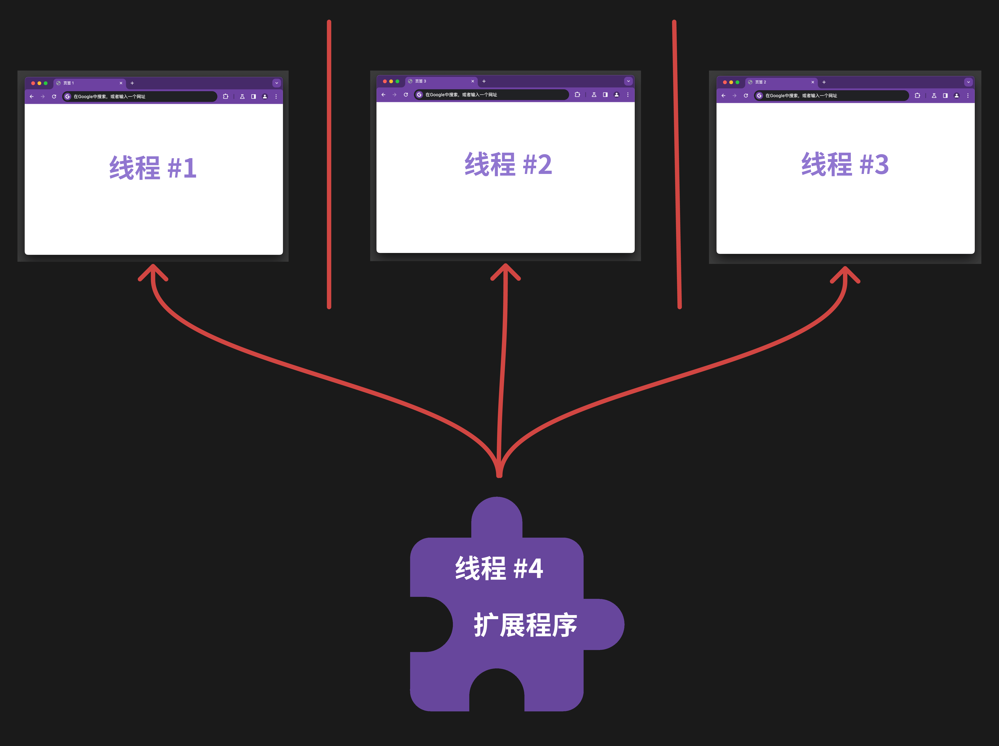

<!-- 
Chrome扩展开发中的消息传递

 -->
<!-- 参考 [Message passing](https://developer.chrome.com/docs/extensions/develop/concepts/messaging) -->
大家好，我是 dom 哥。这是我关于 Chrome 扩展开发的系列文章，感兴趣的可以 [点个小星星](https://github.com/dom-bro/chrome-extension-development)。

一个复杂的 Chrome 扩展程序通常由 `content_scripts`，`background`，`action popup`，`side panel`，`options page`，`devtools` 等部分组成，这些部分所负责的功能各不相同，所处的运行环境各不相同，所能访问的 `chrome.*` API 也各不相同，也因此经常需要通信告诉对方需要做什么。

下面是我画的一张图，简单说明各部分关系：


Chrome 提供了两种通信 API：
- 一种是一次性请求（one-time requests），一次只能发一条消息，类似于手机发短信，跟 HTTP 请求很像
- 一种是长期连接（long-lived connections），允许发送多条消息，类似于手机打电话，跟 Websocket 连接很像

# 一次性请求（one-time requests）

要向扩展的另一部分**发送**单条消息，有两个 API 可供调用：

- `chrome.runtime.sendMessage(extensionId?: string, message: any, options?: object, callback?: function)`
- `chrome.tabs.sendMessage(tabId: number, message: any, options?: object, callback?: function)`

为什么设计两个 API？这要从浏览器的的工作原理说起。

**浏览器的每个页签都是单独的线程**。每个页签运行在与其他页签或扩展相隔离的独立线程中。如下图所示
<!-- 参考 [Extension concepts and architecture](https://learn.microsoft.com/en-us/microsoft-edge/extensions-chromium/getting-started/) -->



`content_scripts` 是一个很特殊的存在！它的生命周期跟随页面。

`chrome.runtime.sendMessage()` 发送的消息可以被扩展的任一部分接收到，除了 `content_scripts`！

`chrome.tabs.sendMessage()` 是专门用来给 `content_scripts` 发消息的！

**接收**消息只有一个 API：
```js
chrome.runtime.onMessage.addListener(
  (
    message: any,
    sender: MessageSender,
    sendResponse: function
  ) => boolean|undefined
)
```

# 长期连接（long-lived connections）

要创建一个可重复使用的长期消息传递通道，有两个 API 可以调用：

- `chrome.runtime.connect(extensionId?: string, connectInfo?: object): Port`
- `chrome.tabs.connect(tabId: number, connectInfo?: object)`

`chrome.runtime.connect()` 用于和扩展的任一部分建立消息通道，除了 `content_scripts`！
`chrome.tabs.connect()` 是专门用来和 `content_scripts` 建立消息通道的！


觉得不错可以 [点个小星星](https://github.com/dom-bro/chrome-extension-development) 支持一下哦 🌹
